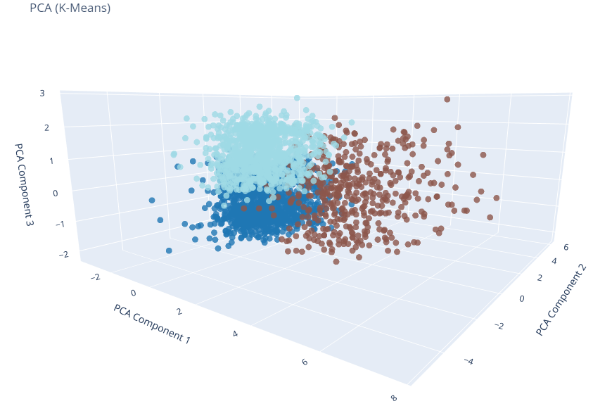

## Harmony Across Genres: Exploring Muscial Relationships with Dimensional Reduction
#### Grant Butler
Florida Institute of Technology
gbutler2020@my.fit.edu

##### Abstract

The search for musical relationships often leads enthusiasts to explore various genres. However, simply grouping by genres often leave much to be desired. By using dimensional reduction and clustering, it is feasible to discover hidden similarities across genres. This study addresses this challenge by using Principal Component Analysis (PCA) and t-distributed stochastic neighbor embedding (t-SNE) in order to reduce the dimensionality of music data while preserving what makes them different. Using three dimensional visualization with a combination of these techniques, a space is created from the data, creating new groupings of tracks based on their features rather than the genre they belong to. This study then proposes to use this technique to group sonically similar songs from differing genres, extracting features that define a given library.

##### 1. Introduction

When looking for relationships between music, people often look for genres to carry the kind of musical energy that they are looking for, often being disappointed to find that many genres have a plethora of sounds and interpretations. Visualizing music catalogs helps to bring new ways to listen to music and find similarities between the sounds songs have[3]. A challenge often seen when trying to design visualizations of libraries and musical interfaces for sample exploration is the high dimensional nature of audio classification[1,2]. Both classification and regression problems can benefit from dimensional reduction of music, allowing for discovery and prediction of where a piece of music could be within a space[4]. Using different combinations of models, it is possible to create combinations and visualizations of music not thought possible without these techniques[3,5].

##### 2. Methods

###### 2.1 Data

Using the Spotify Web API<a href="https://developer.spotify.com/">\*</a> through a Python library, Spotipy<a href="https://spotipy.readthedocs.io/"></a>, data from a library of tracks was downloaded, including their audio features<a href="https://developer.spotify.com/documentation/web-api/reference/get-audio-features"></a>, which outline information about a track, including: acousticness, danceability, duration, energy, instrumentalness, key, liveness, loudness, mode, speechiness, tempo, time signature, and valence. These are all numeric values that describe a specific track, and determine how it fits into the multifaceted world of music. 

In order to pre-process the data for modeling, any empty entries and non-numerical fields were removed. Then, using `scikit-learn`'s (`sklearn`) `StandardScaler` module, the data was centralized and normalized, in order to make the data more interpretable.

###### 2.2 Models

When selecting which models to use, dimensional reduction often is tackled with Principal Component Analysis (PCA), which transforms the data and looks to find a new coordinate system defined by principal components while preserving the variance data has. Using weights, it tries to maximize variance following these equations:

Another commonly used dimensional reduction technique is t-distributed stochastic neighbor embedding (t-SNE). It uses a probability distribution, giving similar objects higher probability and less similar ones a lower one. Then, it minimizes KL divergence<a href="https://en.wikipedia.org/wiki/Kullback%E2%80%93Leibler_divergence"></a> over the map, creating a low dimensional space for high dimensional data.

Using a combination of these two techniques, it would be possible to first reduce the number of principal components, then use a statistical distribution to take the features of data and shape the data's new space using the components that are responsible for much of its variance.

##### 3. Results

**Figure 1:** PCA on raw data

**Figure 2:** t-SNE on raw data

Using just PCA or t-SNE on its own did not separate the data into interpretable clusters, as they both seem to end up with three clusters that still contained too many tracks to interpret any information from.

When checking the loadings of the PCA, or the eigenvectors scaled by the variances, it was found that this data set's audio features ranked as such:

**Figure 3:** Cumulative Explained Variance Ratio vs Number of Principal Components

 | 13 Principal Components             | 6 Principal Components                |
 | ----------------------------------- | ------------------------------------- |
 |  |  |

**Figure 4:** Loadings of PCA

|     Feature      | Sum of Loadings Difference |
| :--------------: | :------------------------: |
|   danceability   |          1.320242          |
|     valence      |          1.122013          |
|   speechiness    |          0.937280          |
|   duration_ms    |          0.858800          |
|       mode       |          0.738354          |
|       key        |          0.679704          |
| instrumentalness |          0.640105          |
|     loudness     |          0.498893          |
|      energy      |          0.433005          |
|   acousticness   |          0.292087          |
|     liveness     |          0.261787          |
|  time_signature  |          0.105881          |
|      tempo       |          0.061163          |

While using 6 principal components, ≈68% of the data's variance was preserved. Both having the variance and the loadings, it is possible to understand the groupings of tracks in the data. 

In order to keep this variance and loadings in mind, PCA was run with different numbers of principal components, from 2 all the way to 6, as the 68% threshold for variance was acceptable. When looking at the loadings, the three that consistently at the top were danceability, valence, and speechiness.

**Figure 5:** PCA t-SNE

**Figure 6:** PCA t-SNE Features Colored

**Figure 7:** PCA t-SNE Features Colored 3D

When using K-Means to cluster this data, it was found that many more groupings of tracks were apparent, as the data started to find niches, where some tracks were grouping into smaller clusters, rather than the three that were found with just PCA or t-SNE on their own. This separation shows definitive differences in the data based on the principal components that PCA found.

For coloring the graph, using a combination of cyan, magenta, and yellow based on the danceability, valence, and speechiness respectively, it was found that the first component corresponded to danceability, while the second one was related to valence, and the third one to speechiness.

##### 4. Conclusion

When using dimensional reduction on music data, it is indeed possible to find features that define a given data set, allowing for definitive separation of the data into interpretable clusters, allowing for direct use of the models and spaces generated when selecting similar sounding music.

**Figure 8:** Average Features of Cluster

Looking at the averages of each of the features, the clusters follow a trend. Being able to see the characteristics of each cluster allows for selection and understanding of the features that define a group of tracks. By reducing the dimensionality of the data, it was possible to find direct representation of the features that defined these tracks.

With this technique, it is possible to find combinations of music across genres that might not go together conventionally. With this, it is possible to create playlists that completely change how one views music and how it should be organized. One library can be vastly different from another, so using this technique and tuning the models to observe what a given library of music is defined by. This allows for people to find what their interests can be defined by, giving them a quantitative way to understand their tastes and adjust how they are grouping their music based on that.

##### 5. References

[1] Atassi, L. (2022, July 30). Hinged t-SNE for Musical Interfaces. NIME. The International Conference on New Interfaces for Musical Expression.

[2] Dupont, S., Ravet, T., Cécile Picard-Limpens, & Frisson, C. (2013, July 1). Nonlinear dimensionality reduction approaches applied to music and textural sounds. ICME. 2013 IEEE International Conference on Multimedia and Expo, San Jose, CA, USA. https://doi.org/10.1109/icme.2013.6607550

[3] Flexer, A. (2015). Improving Visualization of High-Dimensional Music Similarity Spaces. ISMIR 2015, 547–553.

[4] Kin Wai Cheuk, Luo, Y.-J., Balamurali, B. T., Roig, G., & Dorien Herremans. (2020, July 1). Regression-based Music Emotion Prediction using Triplet Neural Networks. ICASSP, IEEE International Conference on Acoustics, Speech and Signal Processing. International Joint Conference on Neural Networks (IJCNN), Glasgow, United Kingdom. https://doi.org/10.1109/ijcnn48605.2020.9207212

[5] Matteo Lionello, Luca Pietrogrande, Hendrik Purwins, & Abou-Zleikha, M. (2018). Interactive Exploration of Musical Space with Parametric t-SNE. Sonic Crossings, 200–208. https://doi.org/10.5281/zenodo.1422557

